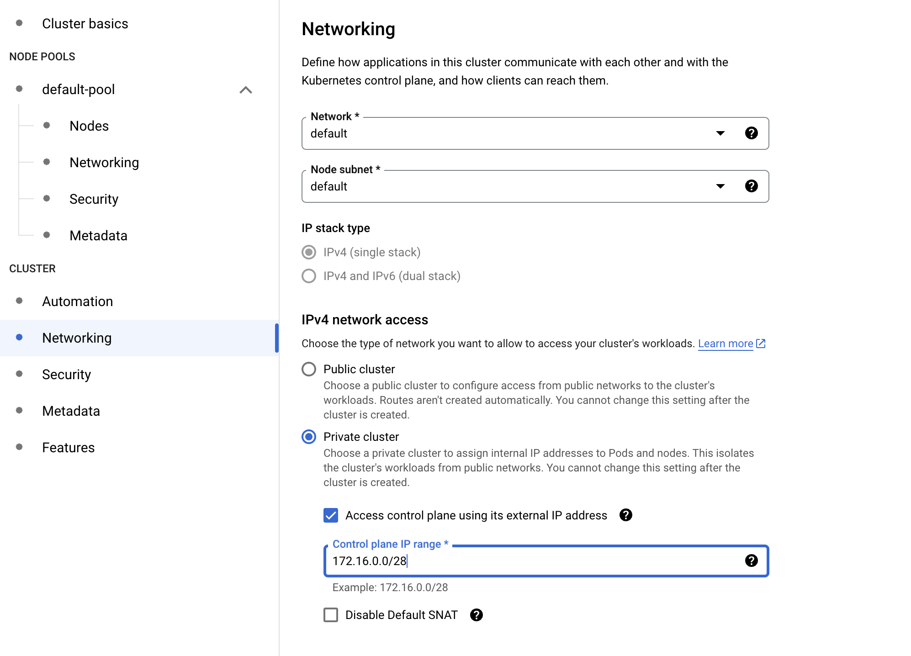

# Налаштування мережевих політик на прикладі кластера GKE

## Створюємо приватний кластер

1) On the Navigation menu (Navigation menu icon), click Kubernetes Engine > Clusters.
2) Click Create.
3) Name the cluster private-cluster.
4) Select REGION as the region.
5) In the left pane, in Cluster click on Networking.
6) Click Private cluster and select Access control plane using its external IP address.
7) For Control plane IP Range, type 172.16.0.0/28
8) Ensure Enable control plane authorized networks is not selected.
9) Create cluster
10) ```gcloud container clusters describe private-cluster --region REGION```

## Налаштовуємо авторизовану мережу для доступу до головного кластера
1) In the Google Cloud Console Navigation menu (Navigation menu icon), click Kubernetes Engine > Clusters.
2) Click private-cluster to open the Clusters details page.
3) In Details tab, under Networking section, for Control plane authorized networks click on Edit(Edit icon).
4) Select Enable Control plane authorized networks.
5) Click Add an authorized network.
6) For Name, type the name for the network, use Corporate.
7) For Network, type a CIDR range that you want to grant whitelisted access to your cluster master. As an example, you can use 192.168.1.0/24.
8) Click Done.
Multiple networks can be added here if necessary, but no more than 50 CIDR ranges.
Note: Outside this lab environment, a practical example might be to whitelist only the public, outside address of your corporate firewall. For example, if your corporate firewall's IP address were 8.8.8.14, you could whitelist access to 8.8.8.14/32.
9) Click Save changes at the bottom of the menu.

## Створюємо мережеву політику кластера
1) In Cloud Shell, type the following command to set the environment variable for the zone and cluster name:
```sh
export my_zone=ZONE
export my_cluster=standard-cluster-1
```
2) In Cloud Shell, type the following command to create a Kubernetes cluster. Note that this command adds the additional flag --enable-network-policy to the parameters you have used in previous labs. This flag allows this cluster to use cluster network policies:
```sh
gcloud container clusters create $my_cluster --num-nodes 3 --enable-ip-alias --zone $my_zone --enable-network-policy
```
3) In Cloud Shell, configure access to your cluster for the kubectl command-line tool, using the following command:
```sh
gcloud container clusters get-credentials $my_cluster --zone $my_zone
```
4) Run a simple web server application with the label app=hello, and expose the web application internally in the cluster:
```sh
kubectl run hello-web --labels app=hello \
  --image=gcr.io/google-samples/hello-app:1.0 --port 8080 --expose
```
5) Create NetworkPolicy manifest file called hello-allow-from-foo.yaml:
```sh
nano hello-allow-from-foo.yaml
```
```yaml
kind: NetworkPolicy
apiVersion: networking.k8s.io/v1
metadata:
  name: hello-allow-from-foo
spec:
  policyTypes:
  - Ingress
  podSelector:
    matchLabels:
      app: hello
  ingress:
  - from:
    - podSelector:
        matchLabels:
          app: foo
```
6) Create an ingress policy:
```sh
kubectl apply -f hello-allow-from-foo.yaml
```
7) Verify that the policy was created:
```sh
kubectl get networkpolicy
```

## Валідуємо політику входу
1) Run a temporary Pod called test-1 with the label app=foo and get a shell in the Pod:
```sh
kubectl run test-1 --labels app=foo --image=alpine --restart=Never --rm --stdin --tty
```
2) Make a request to the hello-web:8080 endpoint to verify that the incoming traffic is allowed:
```sh
wget -qO- --timeout=2 http://hello-web:8080
```
3) Type exit and press ENTER to leave the shell.
4) Now you will run a different Pod using the same Pod name but using a label, app=other, that does not match the podSelector in the active network policy. This Pod should not have the ability to access the hello-web application.
```sh
kubectl run test-1 --labels app=other --image=alpine --restart=Never --rm --stdin --tty
```
5) Make a request to the hello-web:8080 endpoint to verify that the incoming traffic is not allowed:
```sh
wget -qO- --timeout=2 http://hello-web:8080
```
6) Type exit and press ENTER to leave the shell.

## Обмеження вихідного трафіку з Pods
1) Create NetworkPolicy manifest file called foo-allow-to-hello.yaml:
```sh
nano foo-allow-to-hello.yaml
```
```yaml
kind: NetworkPolicy
apiVersion: networking.k8s.io/v1
metadata:
  name: foo-allow-to-hello
spec:
  policyTypes:
  - Egress
  podSelector:
    matchLabels:
      app: foo
  egress:
  - to:
    - podSelector:
        matchLabels:
          app: hello
  - to:
    ports:
    - protocol: UDP
      port: 53
```
2) Create an egress policy:
```sh
kubectl apply -f foo-allow-to-hello.yaml
```
3) Verify that the policy was created:
```sh
kubectl get networkpolicy
```

## Валідуємо політику виходу
1) Deploy a new web application called hello-web-2 and expose it internally in the cluster:
```sh
kubectl run hello-web-2 --labels app=hello-2 \
  --image=gcr.io/google-samples/hello-app:1.0 --port 8080 --expose
```
2) Run a temporary Pod with the app=foo label and get a shell prompt inside the container:
```sh
kubectl run test-3 --labels app=foo --image=alpine --restart=Never --rm --stdin --tty
```
3) Verify that the Pod can establish connections to hello-web:8080:
```sh
wget -qO- --timeout=2 http://hello-web:8080
```
4) Verify that the Pod cannot establish connections to hello-web-2:8080:
```sh
wget -qO- --timeout=2 http://hello-web-2:8080
```
5) Verify that the Pod cannot establish connections to external websites, such as www.example.com:
```sh
wget -qO- --timeout=2 http://www.example.com
```
6) Type exit and press ENTER to leave the shell.
